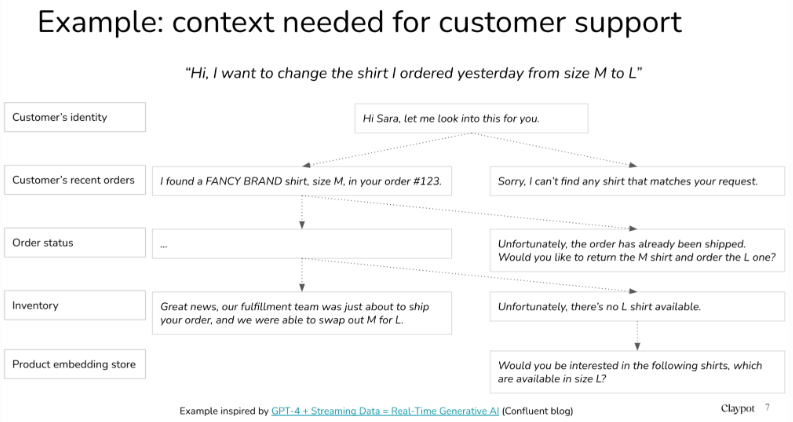
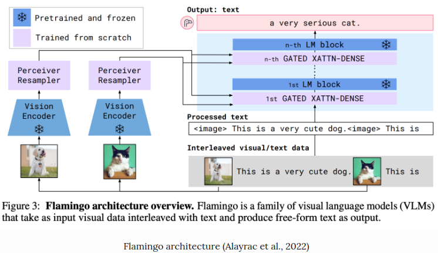
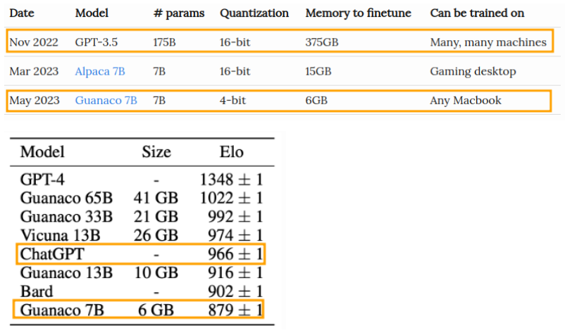
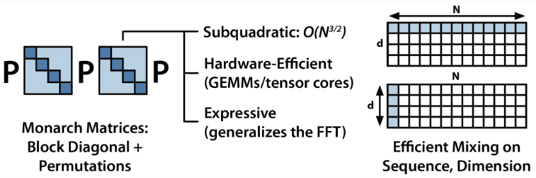
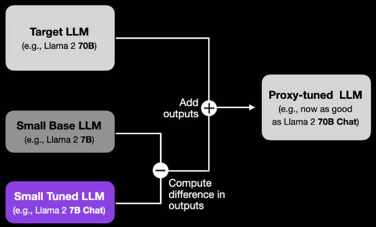

# Recent Research Topics Related To LLM
*LLM Agents*

| S.N | Topics | Overview | Date | Note |
| ---- | ---- | ---- | ---- | ---- |
| 1 | Towards Adaptive Mechanism Activation in Language Agent | - ALAMA helps language agents choose the best way to solve tasks without relying on fixed steps or expert models. - It uses a framework called **UniAct** to unify different solution methods and allows the agent to adaptively pick the best one. - Through **self-exploration**, the agent learns how to activate the right mechanisms based on the specific task, making it more flexible and efficient. | Dec, 2024 | [note](./llm-agent/README.md#towards-adaptive-mechanism-activation-in-language-agent) |
| 2 | Challenges in Human-Agent Communication | Modern AI agents, powered by generative foundation models, perform diverse tasks like coding, booking, or shopping, but pose risks such as unintended actions or security breaches. Ensuring transparency and control is crucial for effective human-agent collaboration. Key challenges include enabling clear communication, establishing shared goals, and addressing the complexity of multi-agent workflows. Future research must address these issues to enhance trust and usability in human-AI systems. | Dec, 2024 | [note](./llm-agent/README.md#challenges-in-human-agent-communication) |

*Chain of Thought / AI Reasoning*

| S.N | Topics | Overview | Date | Note |
| ---- | ---- | ---- | ---- | ---- |
| 1 | Significance of **Chain of Thought Reasoning** in Improving the safety and robustness of AI models like the OpenAI o1 model series | - **Advanced Reasoning**: O1 models use **Chain of Thought (CoT)** reasoning to handle complex tasks safely and effectively. - **AI Safety Leadership**: Achieves top performance in avoiding harmful advice, bias, and jailbreaks. - **Robust Risk Management**: Ensures safety with evaluations, red teaming, and stress-testing. | Dec, 2024 | [note](./openAI/README.md#openai-o1-system-card) |
| 2 | How do LLMs learn to reason from pretraining data? | The study examines how Large Language Models (LLMs) generalize reasoning tasks by analyzing their pretraining data. It finds that:  - LLMs rely on distinct sets of documents for factual vs. reasoning tasks. - For reasoning tasks, the models use documents with procedural knowledge (e.g., solving problems using formulas or code). - The models' reasoning approach is more about synthesizing procedural knowledge rather than retrieval of exact answers. | Nov, 2024 | [note](./openAI/README.md#how-llms-rely-on-pretraining-data-for-reasoning-tasks) |
| 3 |  |  |  |  |
| 4 |  |  |  |  |
| 5 |  |  |  |  |

*LLM*

| S.N | Topics | Overview | Date | Note |
| ---- | ---- | ---- | ---- | ---- |
| 1 | Genie 2 | - **Advancement Over Genie 1**: Moves from generating 2D worlds to creating rich 3D environments with realistic physics, character animations, and agent behavior predictions. - **Core Features**: Simulates complex interactions like jumping, swimming, and object manipulation. It ensures emergent abilities like lifelike animations and agent behavior predictions. - **Training & User Interaction**: Trained on extensive video datasets for consistency. Users can design worlds via text prompts, rendered by Imagen 3, and interact using keyboard or mouse. - **Applications**: Supports AI training, game development, interactive experiences, and behavioral research. | Dec, 2024 | [note](./llm/README.md#genie-2) |
| 2 |  |  |  |  |
| 3 |  |  |  |  |
| 4 |  |  |  |  |

*Reverse Thinking*

| S.N | Topics | Overview | Date | Note |
| ---- | ---- | ---- | ---- | ---- |
| 1 | Reverse-Enhanced Thinking (REVTHINK) | **Reverse-Enhanced Thinking (REVTHINK)** is a framework designed to enable Large Language Models (LLMs) to perform reverse reasoning, a technique that enhances overall reasoning by allowing models to reason both from a problem to a solution and from a solution back to the problem. This dual process provides consistency checks that can improve model performance. | Nov, 2024 | [note](./reverse-thinking/README.md) |

*RAG*

| S.N | Topics | Overview | Date | Note |
| ---- | ---- | ---- | ---- | ---- |
| 1 | Auto-RAG | - **Iterative Retrieval**: A process where models repeatedly query a retriever during content generation to enhance knowledge relevance and improve RAG (Retrieval-Augmented Generation). - **Auto-RAG**: Introduces autonomous iterative retrieval, leveraging LLMs for planning and refining queries via multi-turn dialogues, improving efficiency and accuracy across tasks. - **Key Advantages**: Auto-RAG adapts retrieval iterations based on query complexity, requires no human intervention, and uses natural language for better interpretability. | Nov, 2024 | [note](./rag/README.md#auto-rag) |
| 2 | RARE  | RARE (Retrieval-Augmented Reasoning Enhancement) extends the mutual reasoning framework (rStar) to boost reasoning accuracy and factual integrity in large language models (LLMs). | Dec, 2024 | [note](./rag/README.md#rare-retrieval-augmented-reasoning-enhancement-for-llms) |
| 3 |  |  |  |  |

*Tools*

| S.N | Topics | Overview | Date | Note |
| ---- | ---- | ---- | ---- | ---- |
| 1 | DataLab | A unified Business Intelligence (BI) platform combining LLM-based agents with an augmented computational notebook interface, addressing inefficiencies in the BI workflow. | Dec 2024 | [note](./tools/README.md#datalab) |

| S.N | Topics | Descriptions | Reference |
| :--: | ---- | ---- | ---- |
| 1 | **Reduce and Measure Hallucinations** | [Hallucinations](https://huyenchip.com/2023/05/02/rlhf.html#rlhf_and_hallucination), or the generation of incorrect or nonsensical information by LLMs, are a significant challenge in their practical application.  - **Impact:** Hallucinations hinder the adoption of LLMs in various industries as they can lead to misinformation and erode trust. - **Research Focus:** Considerable effort is being invested in developing methods to detect, measure, and mitigate hallucinations. - **Potential Solutions:** While there's no definitive solution yet, techniques like providing more context, using chain-of-thought prompting, and encouraging concise responses can help reduce hallucinations.  **Why LLMs hallucinate?** - **Hypothesis 1: Lack of Understanding:** LLMs hallucinate because they don't fully grasp the consequences of their generated text. - **Hypothesis 2: Mismatched Knowledge:** Hallucinations arise from discrepancies between the LLM's knowledge and the human labeler's knowledge during training.  **Potential Solutions** - **Verification**: Asking LLMs to cite sources for their information. - **Improved Reward Functions**: Developing reward systems that penalize hallucinations more severely. | [Reduce and measure hallucinations](https://huyenchip.com/2023/08/16/llm-research-open-challenges.html#:~:text=1.-,Reduce%20and%20measure%20hallucinations,-Hallucination%20is%20a) |
| 2 | **Optimize Context Length and Context Construction** | Many questions require specific context to be answered accurately. For instance, asking for the best Vietnamese restaurant needs a location context since the best in Vietnam differs from the best in the US. Research shows that about 16.5% of information-seeking questions are context-dependent, a figure likely higher in enterprise scenarios where customer or product-specific information is essential.  This context learning is crucial for Retrieval Augmented Generation (RAG), a popular method in LLM use cases. RAG operates in two phases:  1. **Chunking (Indexing)**: Documents are divided into chunks, embeddings are created, and stored in a vector database. 2. **Querying**: A user query is converted into an embedding, and the database fetches the most similar chunks.  Longer context can provide more information but isn't always more efficient. Efforts are focused on both increasing context length and improving its efficiency, known as prompt engineering. Recent research indicates that models better understand information at the beginning and end of the context rather than the middle.  | [Optimize context length and context construction](https://huyenchip.com/2023/08/16/llm-research-open-challenges.html#:~:text=NVIDIA%E2%80%99s%20NeMo%2DGuardrails-,2.%20Optimize%20context%20length%20and%20context%20construction,-A%20vast%20majority) |
| 3 | **Incorporate Other Data Modalities** | Multimodality is highly powerful but often underrated. It is crucial for many industries that handle various data types, such as healthcare, robotics, e-commerce, retail, gaming, and entertainment. Examples include: - Medical predictions that require both textual data (doctor's notes, patient questionnaires) and images (CT scans, X-rays, MRIs). - Product metadata that includes images, videos, descriptions, and tabular data (production date, weight, color). Multimodal models can fill in missing product details from reviews or photos and enable visual product searches.  Multimodality also enhances model performance. Models that understand both text and images are likely to outperform those limited to a single modality. Additionally, as the availability of text data for training models diminishes, leveraging other data types becomes essential.  | [Incorporate other data modalities](https://huyenchip.com/2023/08/16/llm-research-open-challenges.html#:~:text=et%20al.%2C%202023) |
| 4 | **Make LLMs Faster and Cheaper** | When GPT-3.5 was released in late November 2022, concerns about its latency and cost in production were prevalent. However, within six months, the community developed a model nearly as performant as GPT-3.5 but with less than 2% of its memory footprint.  **Key takeaway**: If something is good enough, people will find ways to make it fast and cheap.  | [Make LLMs faster and cheaper](https://huyenchip.com/2023/08/16/llm-research-open-challenges.html#:~:text=can%20share%20soon!-,4.%20Make%20LLMs%20faster%20and%20cheaper,-When%20GPT%2D3.5) |
| 5 | **Design a New Model Architecture** | - **Transformer's Longevity:** Despite numerous architecture trends coming and going (LSTM, seq2seq), Transformer has remained remarkably relevant for over 7 years.      - **Challenges of Surpassing Transformer:**          - Extensive optimization over the past 7 years makes it difficult to develop a superior architecture.     - New architectures need to deliver performance at relevant scales and on current hardware (GPUs). - **S4 and the Search for Successor:**          - There was initial excitement for S4 as a potential Transformer replacement (2021).     - However, its impact seems to have faded. - **The Quest Continues:** Chris Ré's lab remains active in exploring new architectures, with their recent Monarch Mixer offering an alternative approach.      - **Focus on Efficiency:** Monarch Mixer aims to overcome the quadratic complexity limitations of Transformer in terms of attention and model dimension size, potentially leading to a more efficient architecture.  | [Design a new model architecture](https://huyenchip.com/2023/08/16/llm-research-open-challenges.html#:~:text=factorization%20and%20quantization.-,5.%20Design%20a%20new%20model%20architecture,-Since%20AlexNet%20in) |
| 6 | **Develop GPU Alternatives** | **Domination of GPUs:**  - Since AlexNet (2012), GPUs have been the primary hardware for deep learning due to their efficiency compared to traditional CPUs. - This accessibility for researchers fueled the deep learning boom.  **The Search for Alternatives:**  - Many companies have attempted to develop specialized AI hardware in the last decade:     - Google's TPUs     - Graphcore's IPUs (uncertain future)     - Cerebras     - SambaNova (shifted focus to generative AI platforms)  **Emerging Technologies:**  - **Quantum Computing:**     - Companies like IBM and Google are making strides in quantum computing, with both commercial and research efforts underway. - **Photonic Chips:** This exciting, less explored direction aims to use light (photons) instead of electricity for faster and more efficient data processing. Several startups are heavily invested in this area. | [Develop GPU alternatives](https://huyenchip.com/2023/08/16/llm-research-open-challenges.html#:~:text=let%20me%20know!-,6.%20Develop%20GPU%20alternatives,-GPU%20has%20been) |
| 7 | **Make Agents Usable** | The concept of agents, which are LLMs capable of taking actions like browsing the Internet or making reservations, represents a relatively new research direction compared to others discussed. There's currently significant excitement and interest in agents due to their novelty and vast potential. Auto-GPT and GPT-Engineering are among the most popular GitHub repositories, reflecting the intense interest in this field.  Despite the enthusiasm, there are concerns about the reliability and performance of LLMs in handling the responsibility of taking actions. However, one emerging use case for agents is in social studies, as demonstrated by the Stanford experiment, where generative agents autonomously organized a Valentine's Day party, showcasing emergent social behaviors.  A notable player in this field is Adept, founded by two co-authors of the Transformer paper and an ex-OpenAI VP. Adept has raised significant funding and showcased a demo where their agent browsed the Internet and added a new account to Salesforce. Excitement surrounds upcoming demos from Adept, indicating the growing interest and potential in agent technology. | [Make agents usable](https://huyenchip.com/2023/08/16/llm-research-open-challenges.html#:~:text=division%20multiplexing%20(WDM).-,7.%20Make%20agents%20usable,-Agents%20are%20LLMs) |
| 8 | **Proxy Tuning** | **Proxy-tuning is a way to adapt LLMs without changing the model's weights. This is especially attractive if a given LLM is too resource-intensive to train or if a user doesn't have access to the LLM's weights.**  **Understanding Proxy-Tuning**  Proxy-tuning provides a target LLM with the capabilities of a tuned version of itself without actually tuning it.  To provide a concrete example, suppose the Llama 2 70B Chat model does not exist yet. Instead, we only have a Llama 2 70B Base model. Proxy-tuning allows us to get this base model to perform as well as the chat model without changing the base model's weights.   Here are the steps to achieve this:  1. Select a base LLM (e.g., an untuned 7B Llama 2 model) smaller and cheaper than the target LLM (e.g., a 10x larger, untuned 70B Llama 2 model).      2. Finetune this smaller base LLM to obtain a small finetuned LLM (e.g., instruction-finetune a 7B Llama 2 model to get a finetuned 7B model).      3. Compute the output difference between the base model (step 1) and the tuned model (step 2).      4. Add this difference in outputs to the target LLM's outputs.      5. Normalize the modified outputs from step 4, and then generate the answer. | [Improve LLMs with Proxy-Tuning](https://lightning.ai/lightning-ai/studios/improve-llms-with-proxy-tuning) |
| 9 | **GenCast: Probabilistic Weather Model** | - **Overview**: GenCast is an ML-based probabilistic weather prediction model that surpasses traditional numerical weather prediction (NWP) ensemble systems in accuracy and speed. It provides medium-range forecasts while accounting for uncertainty, making it highly reliable for decision-making in areas like extreme weather alerts and renewable energy planning.      - **Features**:          - Trained on decades of reanalysis data.     - Produces 15-day global forecasts at 12-hour intervals with a resolution of 0.25° latitude-longitude.     - Generates forecasts for over 80 variables, such as atmospheric conditions and surface metrics, in just 8 minutes. - **Performance**:          - Outperforms the European Centre for Medium-Range Weather Forecasts (ECMWF) ensemble system (ENS) on 97.2% of 1,320 evaluated targets.     - Excels in predicting extreme weather events, tropical cyclone tracks, and wind power production. - **Impact**: GenCast represents a significant advancement in operational weather forecasting, allowing for more accurate, efficient, and actionable weather-dependent decision-making. | [GenCast: Probabilistic Weather Model](https://www.nature.com/articles/s41586-024-08252-9) |

