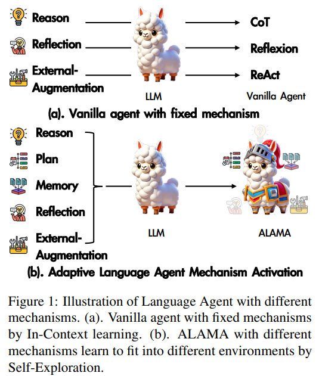

# Towards Adaptive Mechanism Activation in Language Agent
*References:*
- [Research Paper](https://arxiv.org/pdf/2412.00722)

**Adaptive Language Agent Mechanism Activation Learning with Self-Exploration (ALAMA)** proposes a method to improve the adaptability of language agents, allowing them to select and activate the appropriate mechanisms based on task characteristics, without relying on predefined expert models.

Key elements of the approach:

1. **UniAct Framework**: This unifies various agent mechanisms and coordinates them through actions, providing flexibility in decision-making.
2. **Self-Exploration Optimization**: Instead of using expert guidance, the agent learns to adaptively activate mechanisms by exploring the task's specific needs through self-exploration.
3. **Adaptability to Tasks**: ALAMA allows the agent to dynamically adjust its mechanisms based on task demands, improving its ability to handle diverse tasks with varying solution structures.

Experimental results demonstrate that ALAMA leads to significant improvements in agent task performance, showing its effectiveness in enabling more context-sensitive and dynamic behavior across different tasks.

# 