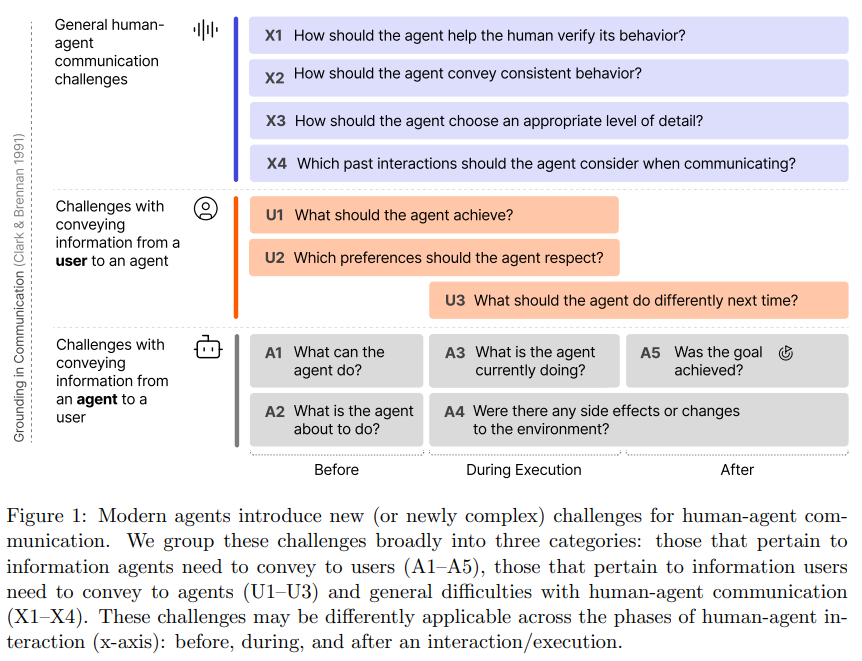

# Towards Adaptive Mechanism Activation in Language Agent
*References:*
- [Research Paper](https://arxiv.org/pdf/2412.00722)

**Adaptive Language Agent Mechanism Activation Learning with Self-Exploration (ALAMA)** proposes a method to improve the adaptability of language agents, allowing them to select and activate the appropriate mechanisms based on task characteristics, without relying on predefined expert models.

Key elements of the approach:

1. **UniAct Framework**: This unifies various agent mechanisms and coordinates them through actions, providing flexibility in decision-making.
2. **Self-Exploration Optimization**: Instead of using expert guidance, the agent learns to adaptively activate mechanisms by exploring the task's specific needs through self-exploration.
3. **Adaptability to Tasks**: ALAMA allows the agent to dynamically adjust its mechanisms based on task demands, improving its ability to handle diverse tasks with varying solution structures.

Experimental results demonstrate that ALAMA leads to significant improvements in agent task performance, showing its effectiveness in enabling more context-sensitive and dynamic behavior across different tasks.

# Challenges-in-Human-Agent-Communication
*References:*
- [Research Paper](https://www.microsoft.com/en-us/research/uploads/prod/2024/12/HCAI_Agents.pdf)

- **Advanced Capabilities and Risks**:
    
    - Modern AI agents leverage generative models for complex tasks, such as executing code, booking flights, or shopping. These actions impact both digital and physical domains.
    - The increasing capabilities introduce potential failures like unintended financial actions, data leaks, or system corruption, especially in high-stakes scenarios.
- **Transparency and User Understanding**:
    
    - Users must understand agents’ capabilities, limitations, and workflows to prevent over-reliance or miscommunication.
    - Effective systems allow users to express goals clearly, monitor behavior, and provide feedback dynamically.
- **Key Challenges**:
    
    - **Agent-to-User**: Conveying clear, transparent information about operations and capabilities.
    - **User-to-Agent**: Allowing intuitive expression of goals and constraints, and effective corrections.
    - **Overarching**: Addressing consistency, complexity, and reducing user burden during interactions.
- **Establishing Common Ground**:
    
    - Successful human-agent collaboration relies on shared understanding of goals and processes.
    - Challenges are amplified by factors like generative models' stochasticity, evolving capabilities, and multi-agent workflows.
- **Call to Action**:
    
    - Future research must address these challenges, drawing parallels from human team coordination and refining principles for human-AI collaboration.
