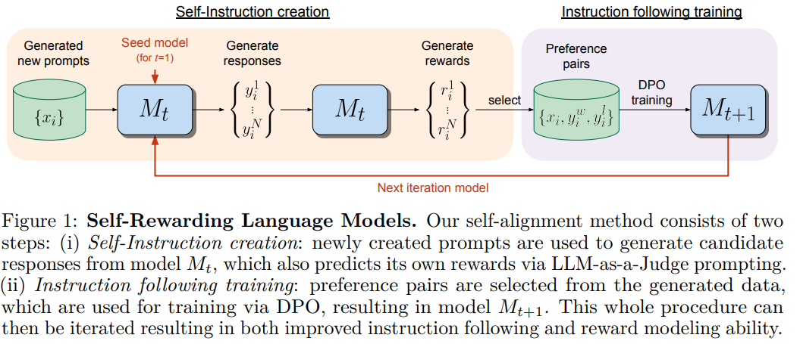
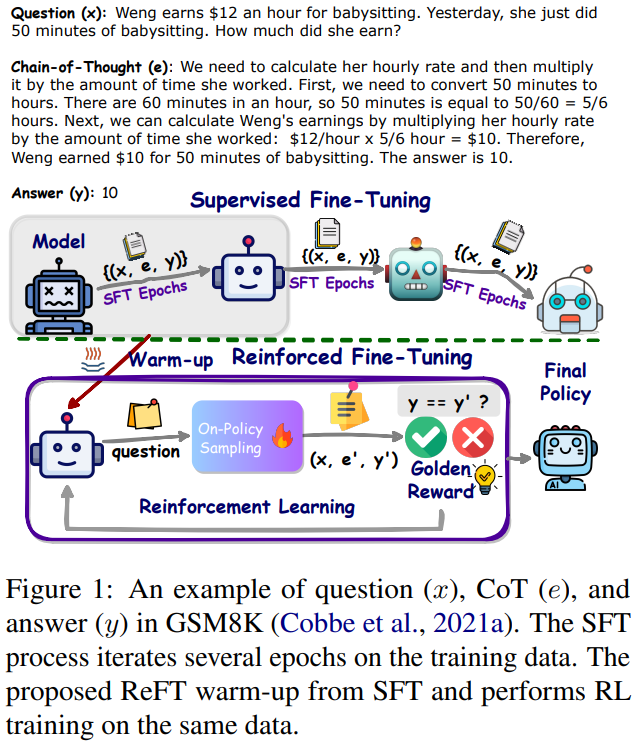

# Self-Rewarding-LLMs
*References:*
- [Research Paper](https://arxiv.org/pdf/2401.10020)

RLHF

- Aligning LLMs to human preference data improves performance.
- **Reinforcement Learning from Human Feedback (RLHF):**
    - **Step 1:** Train a reward model based on human preferences.
    - **Step 2:** Use the frozen reward model to train the LLM using reinforcement learning (e.g., via Proximal Policy Optimization, PPO).
- **Direct Preference Optimization:**
    - Directly use human preferences to train the LLM, skipping the reward model training step.
- Both methods face challenges related to:
    - The size and quality of human preference data.
    - In RLHF, the quality and accuracy of the frozen reward model.

**Self-Rewarding LLMs** (Methodology)

The methodology is iterative. After each round of training, the model again generates prompts, creates responses for them, evaluates them, and again is trained with the new self-generated preference dataset. With each iteration, the model’s ability to generate high-quality responses and to give feedback is expected to improve.

- First of all, instead of manually preparing a training dataset, the model itself generates new training prompts. These prompts are designed to be diverse and cover a wide range of topics and writing styles.
- Once the model has generated responses to its own prompts, it enters the evaluation phase. In this stage, the model acts as its “judge”, assessing the quality of responses. The evaluation includes assigning rewards or feedback to each response. The reward assignment is not arbitrary; it’s based on criteria set by the researchers, ensuring that the model’s self-evaluation aligns with desired performance metrics.
- Next, the responses and their corresponding self-assigned rewards create a new preference dataset, generated entirely by the model’s internal processes. The preference dataset then serves as the basis for further training.

The model undergoes _Direct Preference Optimization_, where it learns to optimize its responses based on the preferences it has previously set. DPO enables the model to iteratively improve its ability to follow instructions and accurately evaluate responses. Essentially, the model ‘learns from its own learning’.

# ReFT
*References:*
- [Research Paper](https://arxiv.org/pdf/2401.08967)

**The Challenge:**

- Standard Supervised Fine-Tuning (SFT) with Chain-of-Thought (CoT) annotations can improve LLM reasoning, but it struggles with generalization.
- In math problems, SFT typically only sees one annotated reasoning path per question, limiting its ability to handle variations.

**The Proposed Solution: Reinforced Fine-Tuning (ReFT):**

- This approach addresses the limitations of SFT by incorporating reinforcement learning.
- **Two-Step Process:**
    1. **Warm-up with SFT:** The model gets initial training using SFT with CoT annotations.
    2. **On-line Reinforcement Learning:** The model is further fine-tuned using an algorithm called PPO. This step involves:
        - Automatically generating multiple reasoning paths for a question.
        - Receiving rewards based on how well these paths lead to the correct answer.

**Benefits of ReFT:**

- Achieves significantly better performance on reasoning tasks compared to SFT.
- Learns from the same training questions as SFT, demonstrating superior generalization ability.
- The code for this approach is publicly available.

**Additional Insights:**

- ReFT's performance can be further enhanced by combining inference-time strategies like majority voting and re-ranking of possible solutions.

Overall, ReFT offers a promising approach to improve the generalization ability of LLMs in reasoning tasks, specifically demonstrated in math problem solving. This method utilizes reinforcement learning to effectively learn from existing training data and automatically generated variations, leading to stronger reasoning capabilities.

