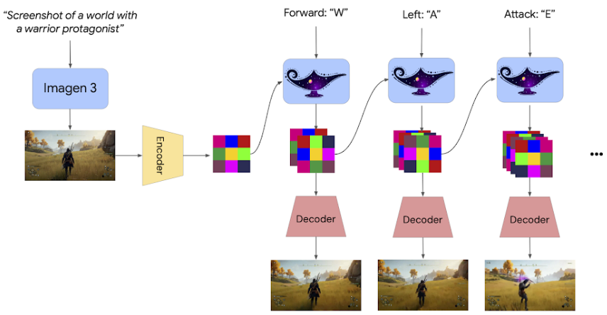

# Genie-2
*References:*
- [Blog](https://deepmind.google/discover/blog/genie-2-a-large-scale-foundation-world-model/)
### **Overview of Genie 2**:

1. **Evolution from Genie 1**:
    
    - **Genie 1**: Focused on generating 2D worlds with a narrow domain scope.
    - **Genie 2**: Expands capabilities to **3D world generation**, enabling the creation of vast, rich, and diverse virtual environments.
2. **Core Capabilities**:
    
    - **World Simulation**:
        - Simulates complex 3D virtual worlds.
        - Models the consequences of actions such as **jump**, **swim**, and other interactive behaviors.
    - **Emergent Abilities** (arising at scale):
        - **Object Interactions**: Accurately models how objects interact within the environment.
        - **Complex Character Animations**: Simulates lifelike movements and interactions.
        - **Physics**: Represents realistic physics, such as gravity, collisions, and fluid dynamics.
        - **Agent Behavior Prediction**: Anticipates and simulates the behavior of other agents in the environment.
3. **Training**:
    
    - Trained on a **large-scale video dataset**, enabling it to learn diverse scenarios and interactions.
    - Utilizes advanced **generative modeling techniques** to achieve high fidelity and consistency in world generation.
4. **User Interaction**:
    
    - **Input**: Users or AI agents interact with the world via **keyboard and mouse actions**.
    - **Output**: Genie 2 simulates the next observation in the sequence, creating a continuous interactive experience.
    - **Prompting**: Begins with a **single image generated by Imagen 3** (GDM’s cutting-edge text-to-image model).
        - Users can **describe a desired world in text**, generate multiple visualizations, and select their preferred rendering for interaction.
5. **Performance and Consistency**:
    
    - Can generate **consistent 3D worlds** for durations up to a minute.
    - Most examples showcase simulations lasting **10-20 seconds**, maintaining realism throughout.
6. **Applications**:
    
    - **Virtual Training and Evaluation**:
        - AI agents can be trained and evaluated in custom 3D environments.
    - **Interactive Experiences**:
        - Users can explore and interact with worlds tailored to their imagination.
    - **Game Development**:
        - Simplifies the creation of immersive and realistic game environments.
    - **Simulation for Research**:
        - Useful for studying agent behaviors, physics interactions, and other dynamic scenarios.
7. **Key Advantages**:
    
    - **Generative Diversity**: Generates a wide range of environments, catering to varied use cases.
    - **Flexibility**: Allows seamless transitions between user-designed static images and interactive dynamic worlds.
    - **Accessibility**: Enables non-technical users to create and explore virtual worlds through simple textual descriptions.

### Architecture
- **Architecture**: Genie 2 employs an autoregressive latent diffusion model. It encodes video data into latent frames using an autoencoder and processes these frames with a large transformer dynamics model, leveraging a causal mask akin to large language models.
    
- **Inference Process**: At runtime, it samples autoregressively, handling actions and past latent frames frame-by-frame, ensuring continuity and realism in generated sequences.
    
- **Action Control**: Classifier-free guidance enhances controllability, allowing precise alignment between input actions and the resulting frames.

