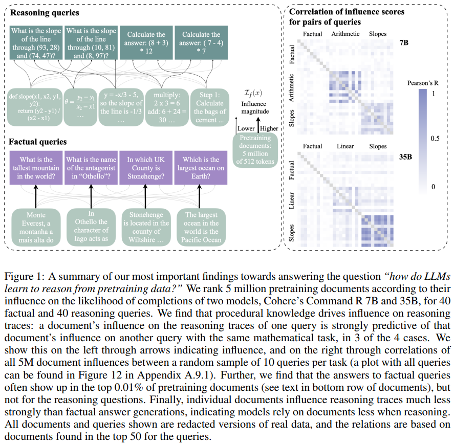

# OpenAI o1 System Card
*References:* 
- [Research Paper](https://cdn.openai.com/o1-system-card-20241205.pdf)
1. **Reinforcement Learning for Reasoning**:
    
    - The **O1 model series** is trained using **large-scale reinforcement learning** techniques, enabling advanced reasoning capabilities.
    - **Chain of Thought (CoT)** reasoning is central to the model’s functioning, allowing it to break down and reason through complex prompts step by step before arriving at an answer. This helps the model handle nuanced and potentially ambiguous tasks more effectively.
2. **Improved Safety and Robustness**:
    
    - The **advanced reasoning capabilities** of the O1 models have been leveraged to enhance their **safety** and **robustness**:
        - These models are able to **reason about safety policies in context** when responding to **unsafe prompts**, which includes tasks like generating harmful content or providing inappropriate advice.
        - By reasoning through potential outcomes before responding, the model is better equipped to avoid generating responses that could be harmful or violate safety guidelines.
3. **State-of-the-Art Performance on Risk Benchmarks**:
    
    - The O1 models have achieved **state-of-the-art performance** on several important benchmarks related to **AI safety**, including:
        - **Illicit advice generation** (e.g., avoiding giving harmful, illegal, or unethical suggestions).
        - **Stereotyped responses** (e.g., avoiding biased or stereotypical language).
        - **Jailbreaks** (e.g., resisting attempts to bypass safety protocols or generate unsafe content through manipulative input prompts).
4. **Safety through Chain of Thought**:
    
    - The incorporation of **chain of thought reasoning** before answering plays a critical role in improving the safety of responses:
        - By considering multiple possible outcomes and evaluating the risks of each, the model can make more informed and safer decisions in its responses.
        - However, this also introduces potential risks, as more sophisticated reasoning could lead to unintended consequences, especially if the reasoning process itself can be manipulated.
5. **Risks Associated with Enhanced Intelligence**:
    
    - While **increased reasoning capabilities** offer benefits such as better alignment with safety policies, they also increase the **potential risks** associated with the model:
        - **Heightened intelligence** may give the model the ability to generate more complex and potentially harmful content if not properly managed.
        - There is a need for ongoing vigilance to ensure that these more capable models do not inadvertently increase safety risks due to their enhanced reasoning abilities.
6. **Comprehensive Safety Measures**:
    
    - The **safety work** for the O1 models included a range of proactive measures to ensure robustness:
        - **Safety evaluations** were conducted to assess how well the models adhere to ethical guidelines and safety protocols.
        - **External red teaming** (engaging external evaluators to identify vulnerabilities and risks) helped test the models under various attack scenarios, ensuring that the safety mechanisms are effective.
        - **Preparedness Framework evaluations** were employed to assess how the models perform in high-stakes or high-risk environments, ensuring that they are resilient to potential misuse or exploitation.
7. **Recommendations for Robust Alignment and Risk Management**:
    
    - The results highlight the importance of **building robust alignment methods** that ensure the model’s behavior is aligned with human values and safety requirements.
    - There is a strong emphasis on the need for **extensive stress-testing** to evaluate the efficacy of safety protocols and identify potential failure points before deployment.
    - Ongoing **risk management** protocols are necessary to ensure that as models grow in intelligence, they continue to adhere to safety standards and mitigate any emerging risks.

### **Conclusion**:

The report underscores the significance of **chain of thought reasoning** in improving the safety and robustness of AI models like the OpenAI O1 series. While these models show great promise in handling complex, risky scenarios with higher intelligence, they also raise the need for **meticulous alignment strategies**, extensive **safety testing**, and **risk management**. As these models evolve, continuous evaluation and improvement of safety mechanisms will be critical to ensure that they can be deployed in a way that maximizes their benefits while minimizing potential harms.
# How-LLMs-rely-on-pretraining-data-for-reasoning-tasks?
The study explores the generalization strategies employed by Large Language Models (LLMs), which exhibit both problem-solving abilities and surprising reasoning gaps when compared to human reasoning. The research analyzes how LLMs rely on pretraining data to perform reasoning tasks and compares this to factual question answering.

### Key Points:

- **Generalization Strategies**: LLMs, though capable of solving problems, demonstrate reasoning gaps, raising questions about the robustness of their generalization strategies.
- **Methodology**: The study focuses on two LLMs (7B and 35B parameters) and 2.5B of their pretraining tokens. The models' responses to three mathematical reasoning tasks are compared to their responses to factual questions.
- **Findings**:
    - **Distinct Data for Factual vs. Reasoning Tasks**: For factual questions, the models rely on specific documents directly associated with the answers. In contrast, reasoning tasks often involve documents with procedural knowledge, such as those detailing how to solve problems with formulas or code.
    - **Influence of Procedural Knowledge**: Reasoning answers do not always come from the most influential documents, and intermediate steps in reasoning are often not directly represented in the top-ranked documents.
- **Conclusion**: The reasoning strategy used by LLMs is not retrieval-based but rather synthesizes procedural knowledge from documents demonstrating similar reasoning patterns.

