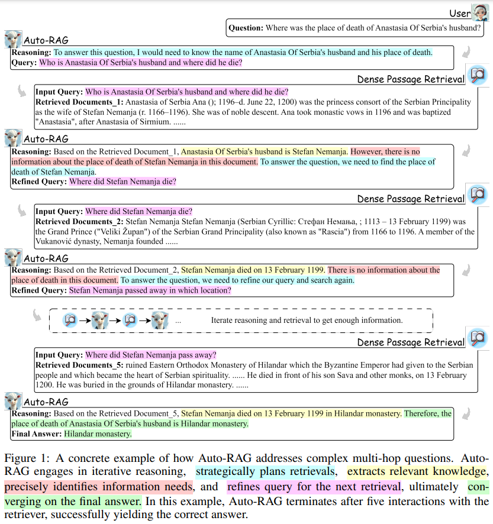

# Auto-RAG
1. **What is Iterative Retrieval?**
    
    - Iterative retrieval involves continuously refining and querying a retriever during the generation process. This helps in retrieving highly relevant information and improving the overall performance of Retrieval-Augmented Generation (RAG).
2. **Challenges in Existing Methods:**
    
    - Existing approaches rely on few-shot prompting or manually crafted rules to guide retrieval. These methods can be inefficient, adding computational complexity and failing to fully utilize the reasoning power of LLMs.
3. **Introduction to Auto-RAG:**
    
    - Auto-RAG is an innovative iterative retrieval model leveraging the reasoning capabilities of LLMs for autonomous decision-making.
    - Instead of relying on fixed rules, Auto-RAG dynamically plans and adjusts retrieval strategies through multi-turn dialogues with a retriever.
4. **How It Works:**
    
    - **Multi-Turn Dialogues:** Auto-RAG iteratively interacts with the retriever, refining queries to gather comprehensive knowledge.
    - **Dynamic Adjustments:** The system autonomously determines how many retrieval iterations are required based on the complexity of the task.
    - **Natural Language Interpretability:** It expresses the iterative retrieval process in natural language, making it user-friendly and transparent.
5. **Training Methodology:**
    
    - The framework fine-tunes open-source LLMs with decision-making instructions to support reasoning-based iterative retrieval.
    - It synthesizes these instructions autonomously, ensuring minimal reliance on human intervention.
6. **Performance Insights:**
    
    - Auto-RAG achieves remarkable results across six benchmarks, showcasing significant improvements in retrieval relevance and task performance.
    - The system efficiently balances the retrieval process, optimizing the number of iterations to maintain both accuracy and speed.
7. **Key Advantages:**
    
    - **Autonomy:** No need for manual intervention; the system adapts retrieval strategies dynamically.
    - **Reasoning Integration:** Leverages LLMs' advanced reasoning capabilities for better decision-making.
    - **Enhanced User Experience:** Provides natural language explanations, improving system transparency and user understanding.
8. **Applications:**
    
    - Useful in research, customer support, and any domain requiring retrieval-based reasoning.
    - Ideal for complex queries where multiple rounds of refined information gathering are necessary.

**Significance:** Auto-RAG represents a step forward in integrating reasoning-based autonomy into retrieval-augmented systems, combining efficiency, transparency, and adaptability to redefine how LLMs interact with external knowledge sources.

