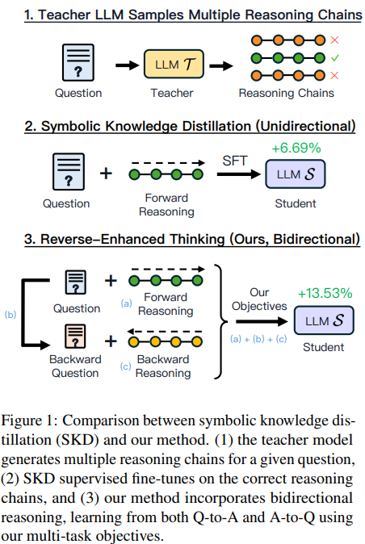

# Reverse Thinking Makes LLMs Stronger Reasoners
*References:*
- [Research Paper](https://arxiv.org/pdf/2411.19865)

- **Concept of Reverse Thinking**:
    
    - Humans employ reverse thinking by reasoning backward from a solution to verify or refine the problem.
    - This approach improves reasoning performance by enabling **consistency checks** between forward and reverse thought processes.
- **Objective**:
    
    - Extend reverse reasoning capabilities to **Large Language Models (LLMs)** for enhanced logical, mathematical, and commonsense reasoning.
- **Framework Overview**:
    
    - **REVTHINK Framework** is a novel methodology combining:
        - **Data Augmentation**: Enriches the training dataset with structured forward-backward reasoning.
        - **Learning Objectives**: Utilizes a multi-task learning strategy to train LLMs effectively.
- **Data Augmentation Process**:
    
    - Involves generating structured reasoning data with four key components:
        1. **Original Question**: The problem to solve.
        2. **Forward Reasoning**: The logical steps leading to the solution.
        3. **Backward Question**: Derived from the solution to infer the original problem.
        4. **Backward Reasoning**: The logical steps connecting the solution back to the question.
    - Data is produced by a **teacher model** and used to train a smaller **student model**.
- **Learning Objectives**:
    
    - Multi-task learning approach includes:
        1. **Forward Reasoning Generation**: Predict forward reasoning steps from the question.
        2. **Backward Question Generation**: Infer the backward question from the forward question.
        3. **Backward Reasoning Generation**: Predict reasoning steps from the backward question.
- **Experimental Results**:
    
    - Evaluated across **12 datasets** covering commonsense, math, and logical reasoning tasks.
    - Achieved significant improvements:
        - **+13.53%** over the student model's zero-shot performance.
        - **+6.84%** over the strongest knowledge distillation baselines.
    - Demonstrated exceptional **sample efficiency**:
        - Using only **10% of forward reasoning data**, outperformed standard fine-tuning trained on **10× more forward reasoning data**.
    - Showed robust **generalization** to out-of-distribution datasets.
- **Advantages of REVTHINK**:
    
    - **Consistency in Reasoning**:
        - Enhances reasoning reliability by integrating forward and backward logic.
    - **Sample Efficiency**:
        - Performs well even with limited training data.
    - **Generalization**:
        - Handles new datasets effectively without significant retraining.
    - **Structured Learning**:
        - Learns both the reasoning process and the interdependencies between forward and reverse reasoning.
- **Applications**:
    
    - Useful for **complex reasoning tasks** in AI systems.
    - Enhances LLM performance in domains requiring **logical consistency**, such as:
        - **Mathematics**.
        - **Commonsense reasoning**.
        - **Logic puzzles and problem-solving**.
- **Conclusion**:
    
    - **REVTHINK** showcases a pioneering approach to integrating reverse thinking into LLM training, enhancing reasoning accuracy and robustness.
    - This framework paves the way for developing **smarter, more efficient AI systems** capable of consistent and logical decision-making.

