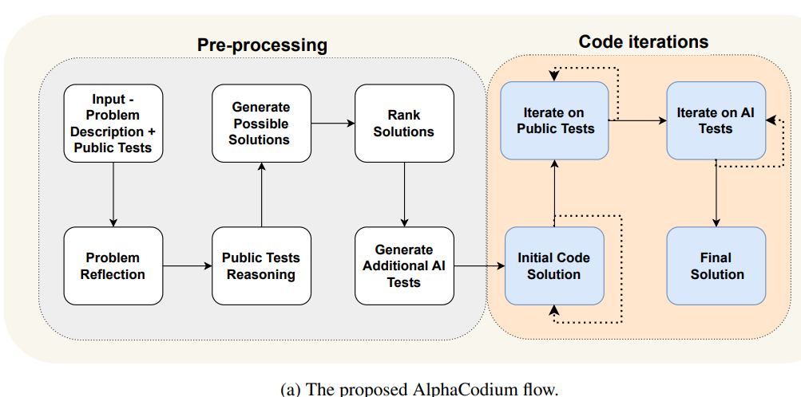

# DataLab
*References:*
- [Research Paper](https://arxiv.org/pdf/2412.02205)

- **DataLab**: A unified Business Intelligence (BI) platform combining LLM-based agents with an augmented computational notebook interface, addressing inefficiencies in the BI workflow.
    
- **Core Features**:
    
    - Integrates various BI tasks through LLM assistance and user customization in a single environment.
    - Incorporates domain-specific knowledge for enterprise BI tasks.
    - Facilitates inter-agent communication for better information sharing across BI workflows.
    - Enhances context utilization efficiency with a cell-based management strategy in BI notebooks.
- **Performance**:
    
    - Achieves state-of-the-art performance on BI tasks in benchmarks.
    - Demonstrates a 58.58% increase in accuracy and a 61.65% reduction in token costs on real-world datasets from Tencent.

DataLab optimizes BI workflows by consolidating tasks and improving both accuracy and efficiency for enterprise-specific BI applications.

# AlphaCodium
*References:*
- [Research Paper](https://arxiv.org/pdf/2401.08500)

AlphaCodium is a new approach to code generation by large language models (LLMs) that shifts the focus from prompt engineering to flow engineering. It follows a test-driven, multi-stage process that iteratively runs and fixes the generated code until it achieves complete accuracy.**

**The AlphaCodium flow engineering**

AlphaCodium flow engineering is a new approach to code generation by LLMs that improves their performance on code problems. It is a test-based, multi-stage, code-oriented iterative flow that continuously refines and improves the generated code until it achieves the desired accuracy.

The flow engineering process consists of two main stages:

**I. Pre-processing**: the problem spec is examined to find its main goal and conditions. Based on this, a brief outline of the expected code is created. They also used extra data from self-reflection and AI-generated tests, to increase the variety and coverage of test cases.

**II. Code iterations:** a series of iterations are performed, each involving generating candidate code, executing it against a set of tests, and refining the code based on the test results. These iterations help the model to gradually improve its understanding of the problem and produce more accurate and efficient code.

