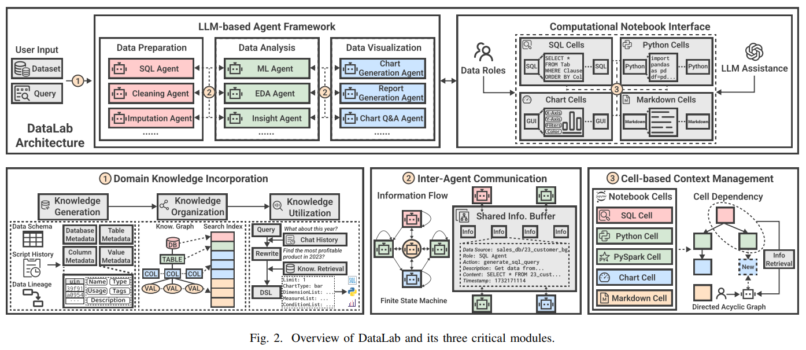

# DataLab
*References:*
- [Research Paper](https://arxiv.org/pdf/2412.02205)

- **DataLab**: A unified Business Intelligence (BI) platform combining LLM-based agents with an augmented computational notebook interface, addressing inefficiencies in the BI workflow.
    
- **Core Features**:
    
    - Integrates various BI tasks through LLM assistance and user customization in a single environment.
    - Incorporates domain-specific knowledge for enterprise BI tasks.
    - Facilitates inter-agent communication for better information sharing across BI workflows.
    - Enhances context utilization efficiency with a cell-based management strategy in BI notebooks.
- **Performance**:
    
    - Achieves state-of-the-art performance on BI tasks in benchmarks.
    - Demonstrates a 58.58% increase in accuracy and a 61.65% reduction in token costs on real-world datasets from Tencent.

DataLab optimizes BI workflows by consolidating tasks and improving both accuracy and efficiency for enterprise-specific BI applications.
